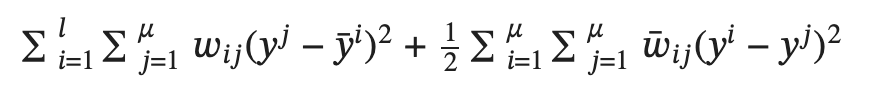
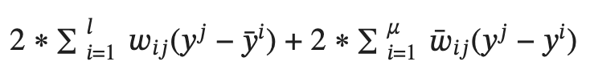

# Optimization of a Semisupervised Learning Model  

**Class:** SP25 Optimization, University of Padova  
**Professors:** Francesco Rinaldi, Gennaro Auricchio  
**Authors:** Natalya Lavrenchuk (ID: 2141882), Christina Caporale (ID: 2141881)  

---

## Project Overview
The motivation of this project is to implement a **semi-supervised learning model** that assigns labels to unlabeled data points by minimizing a custom loss function. The loss function encourages:  
- Consistency between nearby data points  
- Agreement with known labels  

To solve this optimization problem, we apply two widely used methods:  
1. **Gradient Descent (GD)**  
2. **Block Coordinate Gradient Descent (BCGD)** with a **Gauss-Southwell (GS)** update scheme  

We then apply the same framework to the publicly available **Breast Cancer Wisconsin dataset**, predicting whether tumors are **benign or malignant** using both GD and BCGD.

---

## Key Features
- Implementation of a custom semi-supervised loss function (assignment-provided)  
- Optimization via Gradient Descent and Block Coordinate Gradient Descent  
- Application to cancer classification (benign vs malignant)  
- Comparison of GD vs BCGD performance and convergence  

---

## 🔢 Loss Function
The error is defined by two terms:  

1. The similarity of **unlabeled points** to those that are already **labeled**  
2. The similarity of **unlabeled points** to other **unlabeled points**  

The loss function is:  


 

To perform optimization, we consider the derivative of the loss function:



---

## Results
- On the **synthetic dataset (loss function)**, the model achieved an **accuracy of ~70%**  
- On the **breast cancer dataset**, the model achieved an **accuracy of ~68%**  
- The model reached a **recall of ~73%** on the cancer dataset, showing strong sensitivity in detecting malignant cases  
- BCGD with Gauss-Southwell updates showed faster convergence than GD  


---

## How to Run
1. Clone the repository:  
   ```bash
   git clone https://github.com/YOUR-USERNAME/YOUR-REPO-NAME.git
   cd YOUR-REPO-NAME
   

